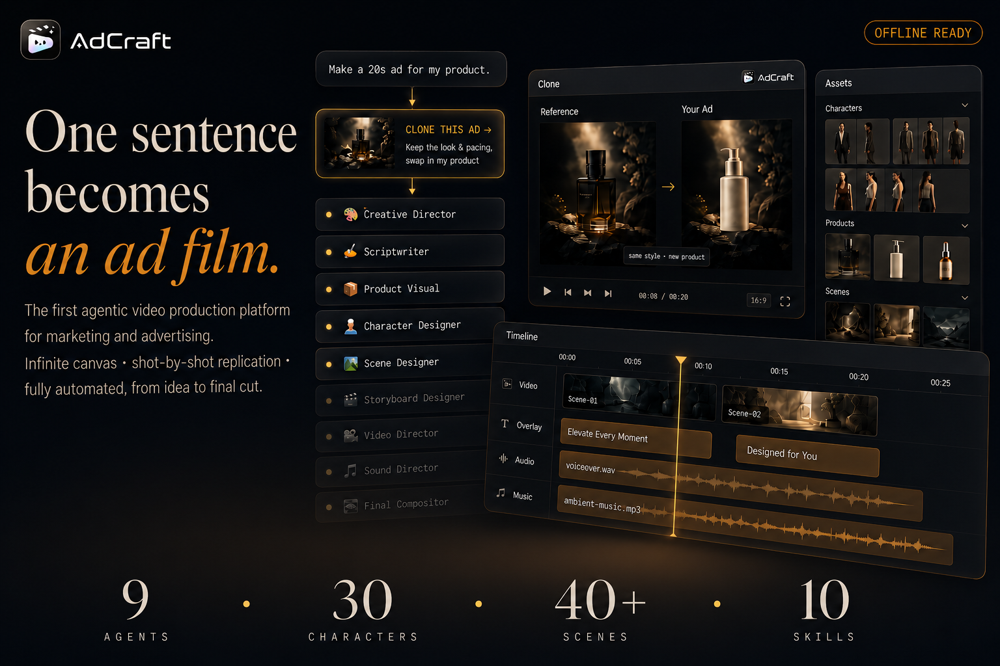
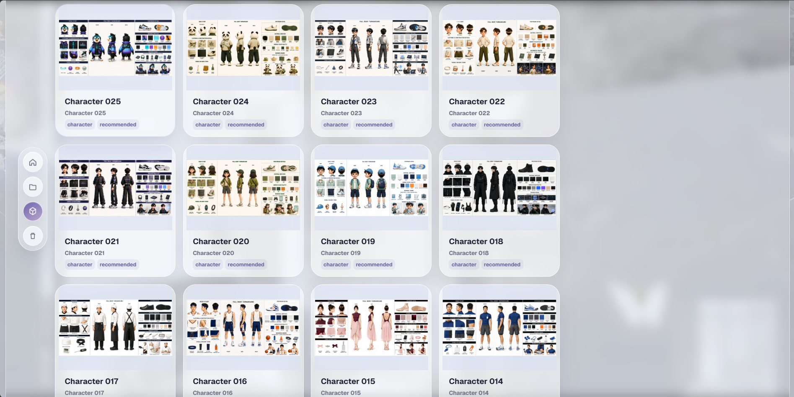
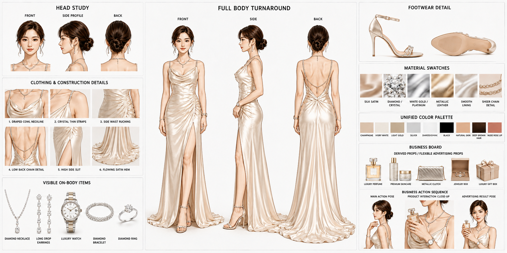
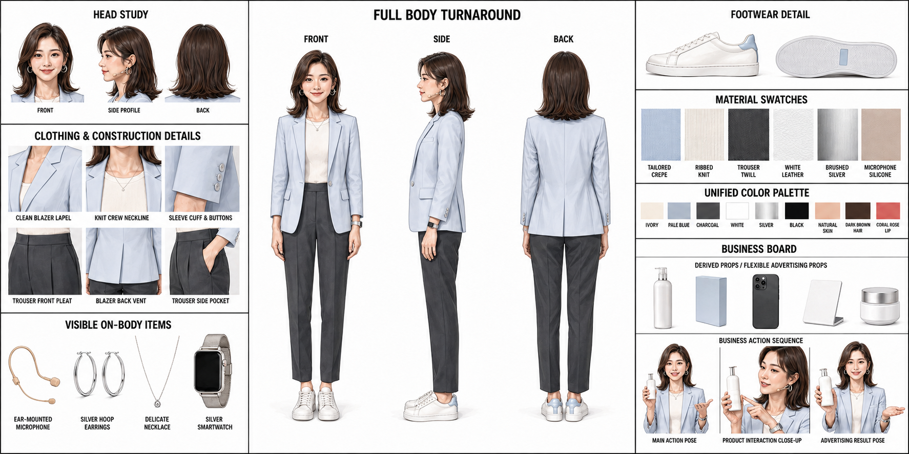
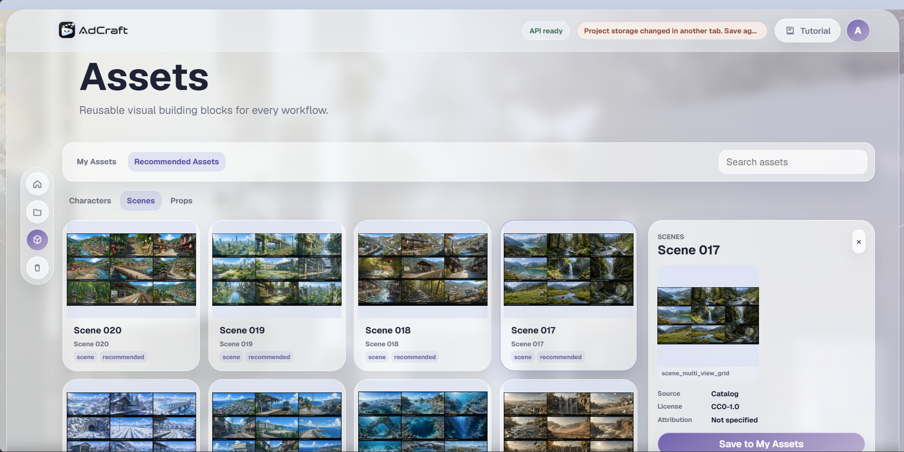
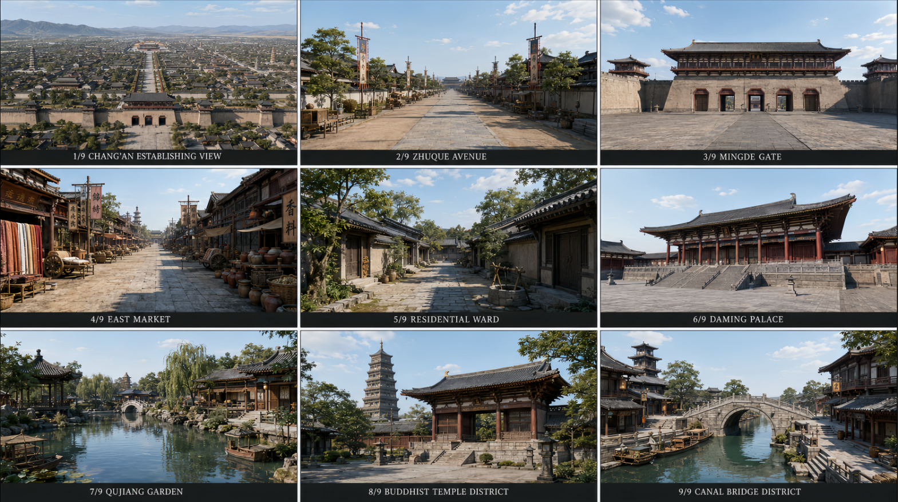
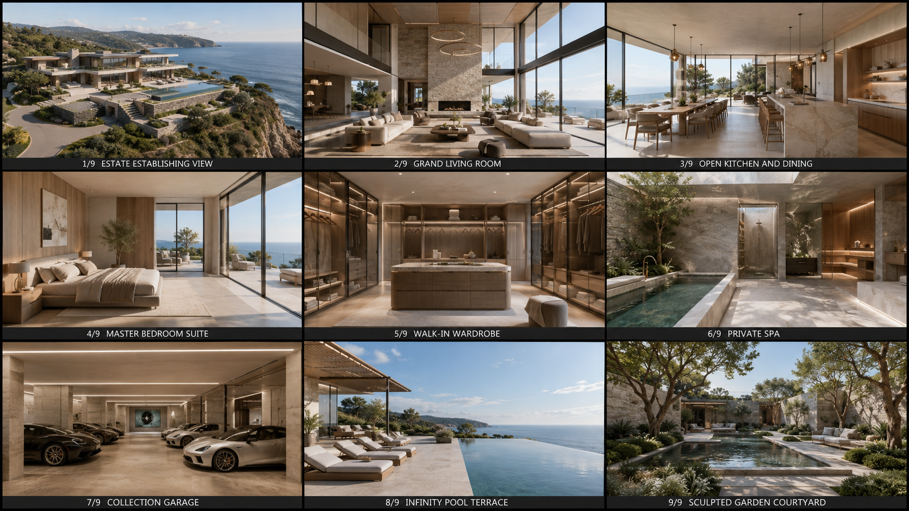

<!-- 👇 在这里替换成你的封面 Banner 图 -->

# AdCraft 🎬

### The First Agentic Video Production Platform for Marketing & Advertising

**From a rough idea to a finished ad — AdCraft automates your entire advertising video workflow.**

**English** · [简体中文](./README_zh.md) · [Live Demo](#) · [Documentation](#)

---

## 🎥 See It In Action

<!-- 👇 在这里放核心功能演示 GIF：展示"从想法到成片"的全流程，或"无限画布"操作 -->

  

 

> Just describe your idea — *what the product is, which selling points to highlight, the style you want, the video length, and the target platform* — and AdCraft automatically builds a complete, editable ad production pipeline for you.

---

## 📰 News

- **[2026-XX-XX]** 🎉 AdCraft is now open-source!
- **[2026-XX-XX]** 🚀 Released Video Cloning — deconstruct any reference ad and rebuild it with your own content.
- **[2026-XX-XX]** ✨ Added multi-platform model support (Seedance, Kling, Vidu, and more).

<!-- 后续更新持续追加到这里 -->

---

## 🌟 Showcase — Ad Videos Across Industries

> Real ad videos produced with AdCraft, spanning multiple industries.
> <!-- 在这里放你不同领域的广告案例，建议用视频封面缩略图 + 播放链接 -->

<table>
  <tr>
    <td align="center"><b>🚗 Automotive</b> </td>
    <td align="center"><b>🍔 Food</b> </td>
    <td align="center"><b>🥤 Beverage</b> </td>
  </tr>
  <tr>
    <td align="center"><b>💄 Beauty</b> </td>
    <td align="center"><b>👗 Apparel</b> </td>
    <td align="center"><b>🧴 Daily Goods</b> </td>
  </tr>
  <tr>
    <td align="center"><b>🔌 Appliances</b> </td>
    <td align="center"><b>📱 Electronics</b> </td>
    <td align="center"><b>➕ More coming</b> </td>
  </tr>
</table>

---

## 💡 What is AdCraft?

AdCraft is an **AI production platform built for advertising creation**. You don't design the production process in advance — you just describe what you need, and the system orchestrates the entire journey: **creative planning → script → product visuals → characters → scenes → storyboard → asset generation → editing → final cut.**

It's not just a one-shot video generator. AdCraft organizes the whole ad-making process into an **editable creative workflow**. After generation, you can keep refining anything — a character, a scene, a shot, an image, a clip, or the entire ad — through canvas operations or natural conversation with AI.

---

## ✨ Core Features

### 1. 🎯 From a Vague Idea to a Complete Ad Plan
No need to design a pipeline upfront. Just describe your requirement, and the system automatically generates the **ad script, product visual plan, character settings, scene design, storyboard script, storyboard images, storyboard videos, background music, and the final composition plan.**

### 2. 🧩 Fully Editable Ad Workflow
What you get is an **editable creative workflow**, not a fixed assembly line. Add or remove steps, reorder them, edit content, run a single step, or continue generating from any point. Assets you're happy with are preserved — no need to redo everything.

### 3. 💬 Control Your Creation Through Conversation
Talk to the AI directly: *"Revise the third shot," "Regenerate this character," "Use this image as a reference for later shots," "Make the overall look cleaner."* The system understands **what** you want to change and **how**, then generates new candidates — asking for confirmation when needed.

### 4. 🤖 Specialized AI Agents Working Together
A team of professional creative agents handles each stage of production:

| Agent | Responsibility |
|-------|---------------|
| 🎨 **Creative Director** | Understands needs, breaks down goals, plans the overall workflow |
| ✍️ **Scriptwriter** | Ad structure, selling points, voiceover & subtitle copy |
| 📦 **Product Visual** | Product shots, packaging, selling-point & detail imagery |
| 👤 **Character Designer** | Models, virtual characters, brand ambassadors, game characters |
| 🏞️ **Scene Designer** | Space, environment, lighting, weather, atmosphere |
| 🎬 **Storyboard Designer** | Shot breakdown, framing, camera movement, timing |
| 🎥 **Video Director** | Turns storyboard/reference images into video clips |
| 🎵 **Sound Director** | Background music, sound effects, narration, rhythm |
| 🎞️ **Final Compositor** | Assembles video, subtitles, music & product assets into the final cut |

### 5. 📚 A Unified Asset Library Across the Whole Process

Every uploaded and generated image, video, and audio asset flows into a **unified asset library** instead of becoming a disposable temporary file.

Each asset preserves its **source, version history, generation notes, usage status, and project references**, making it easy to reuse approved creative materials across shots, workflows, and advertising projects.

AdCraft maintains dedicated libraries for different types of production assets:

- **Character Library** — reusable character systems for consistent identity across shots and campaigns
- **Scene Library** — coherent visual worlds with multi-shot and multi-angle references
- **Product Library** — packaging, front and back views, side views, materials, and close-up details
- **Image, Video & Audio Libraries** — generated and uploaded media organized throughout the production process

Assets can be reused, extended, regenerated, or saved as references for later stages without restarting the entire workflow.

### 6. 🗂️ Production-Ready Character & Scene Assets

AdCraft provides a growing collection of reusable character and scene assets for advertising, branded storytelling, short-form video, and AI-assisted production.

These assets are not isolated reference images. They are designed as **complete production systems** that support visual consistency across different shots, camera angles, actions, and commercial scenarios.

#### 👤 Character Asset Library

  
   
  Browse reusable character assets directly inside the AdCraft asset library.

 

Every character asset that we release for free and open-source use is designed as a **complete character specification**, rather than a single portrait or concept image.

A typical character asset includes:

- **Three-view turnaround** — front, side, and back views for stable identity and body proportions
- **Head and facial references** — front, profile, back, hairstyle, facial structure, and expression details
- **Clothing construction details** — garment structure, tailoring, materials, folds, and key design elements
- **Accessories and on-body items** — footwear, jewelry, watches, bags, props, and other visible details
- **Unified color and material palettes** — consistent colors, fabrics, metals, and surface references
- **Extended commercial scenarios** — product interactions, advertising poses, business contexts, and campaign-ready action references

Together, these references help preserve the same character identity across close-ups, full-body shots, different poses, camera changes, and newly generated advertising scenes.

<table>
  <tr>
    <td width="50%" align="center" valign="top">
      
       
      
        <b>Character Asset Example 01</b> 
        Three-view turnaround, clothing details, materials, accessories, and extended commercial scenarios.
      
    </td>
    <td width="50%" align="center" valign="top">
      
       
      
        <b>Character Asset Example 02</b> 
        A complete visual specification designed for consistent multi-shot character generation.
      
    </td>
  </tr>
</table>

#### 🌍 Scene Asset Library

  
   
  Explore reusable scene worlds and save them directly to your AdCraft workspace.

 

AdCraft scene assets are designed as **complete world-building storyboards**, rather than individual background images.

Each scene asset usually contains a coherent collection of storyboard-ready views, such as:

- **Establishing shots** that define the overall location and visual identity
- **Wide, medium, and close shots** for different storytelling needs
- **Multiple camera angles and viewpoints** within the same environment
- **Interior, exterior, and environmental detail shots**
- **Transition and connecting shots** for continuous scene construction
- **Consistent architecture, lighting, atmosphere, geography, and visual language**

This allows creators and AI agents to build an entire sequence inside the same world while maintaining environmental continuity across shots.

<table>
  <tr>
    <td width="50%" align="center" valign="top">
      
       
      
        <b>Scene Asset Example 01</b> 
        A complete world-building storyboard with multiple locations, shot sizes, and camera perspectives.
      
    </td>
    <td width="50%" align="center" valign="top">
      
       
      
        <b>Scene Asset Example 02</b> 
        Consistent environmental references prepared for multi-shot advertising and narrative production.
      
    </td>
  </tr>
</table>

### 7. 🎛️ Fine-Grained Editing Down to Any Element
Edit an entire stage, or just a single character, scene, shot, image, or clip. **Local edits only affect related content** and won't overwrite the results you're already satisfied with.

### 8. 🔄 Candidate Versions & History Rollback
Every regeneration first appears as a **candidate version** — preview, accept, reject, switch, or roll back. Only confirmed versions enter your current ad, and can be saved to the asset library for future projects.

### 9. 📊 Real-Time Generation Progress
The canvas shows the **true status of every stage** — queued, generating, awaiting confirmation, completed, failed, skipped. When multiple stages run in parallel, you always know exactly what's in progress and what's done.

### 10. ✂️ Final Editing & Composition
The final stage assembles confirmed clips, music, subtitles, and product images into an **editable timeline.** Adjust clip order, trim durations, edit subtitles, tweak audio and asset toggles, then render your complete ad.

### 11. 🧬 Video Cloning — Deconstruct a Reference, Rebuild a New Ad
Upload a reference ad or short video, and the system "reads" it like a professional creator would — analyzing shot by shot: how it hooks attention, how shots transition, the framing and camera movement of each shot, character actions, how the product appears, how subtitles and SFX sync, and where the pacing accelerates or pauses.

It then converts the reference into an **editable ad structure.** Keep the original's rhythm, shot structure, and narrative, but swap in **your own product, characters, scenes, style, and copy** — producing an ad that's *"structurally similar but entirely new."*

> This isn't simple copying — it turns the shot language, rhythm, and expression of great ads into a **reusable creative workflow.**

### 12. ⚡ Preset Creative Flows & Skill Templates
The system accumulates preset flows and Skill templates for different ad scenarios — **product showcase, game user-acquisition ads, e-commerce seeding ads,** and more. Pick a scenario and jump straight into the matching workflow.

### 13. 🔌 Multi-Platform Model Support, Configured in One Place
AdCraft isn't locked to a single model. It integrates multiple mainstream image, video, and audio generation platforms:
- **Image** — Jimeng, Doubao/Seedream, Tongyi Wanxiang, Tencent Hunyuan Image, MiniMax Image, and more
- **Video** — Seedance, Jimeng, Kling, Hailuo, Vidu, Tongyi Wan, Tencent Hunyuan Video, and more
- **Audio** — MiniMax Speech/Music, CosyVoice, Doubao Voice, Tencent Cloud Voice, iFlytek Spark Voice, Baidu AI Cloud Voice, and more

Manage API keys, default models, aspect ratios, resolution, duration, audio toggles, and watermark settings in one **configuration center.** Different stages can use different platforms, with default and fallback options — making production more flexible and reliable.

---

## 🏗️ How It Works
💡 Idea → 🎨 Creative Plan → ✍️ Script → 📦 Product Visuals → 👤 Characters
↓
🚀 Final Cut ← 🎞️ Composition ← 🎵 Sound ← 🎥 Videos ← 🎬 Storyboard ← 🏞️ Scenes

All orchestrated by AI agents, fully editable on an infinite canvas.

---

## 🤝 Contributing

We welcome contributions of all kinds! Please see our [Contributing Guide](#) to get started.

## 📄 License

This project is licensed under the **[GNU General Public License v3.0](./LICENSE)**.

You are free to run, study, share, and modify this software. Any distributed
derivative work must also be released under the GPL v3, keeping the software
free for all users. See the [LICENSE](./LICENSE) file for the full text.

## 💬 Community

- [Discord](#) · [Twitter/X](#) · [WeChat Group](#)

**⭐ If you find AdCraft useful, please give us a star!**

Made with ❤️ by the AdCraft Team

