

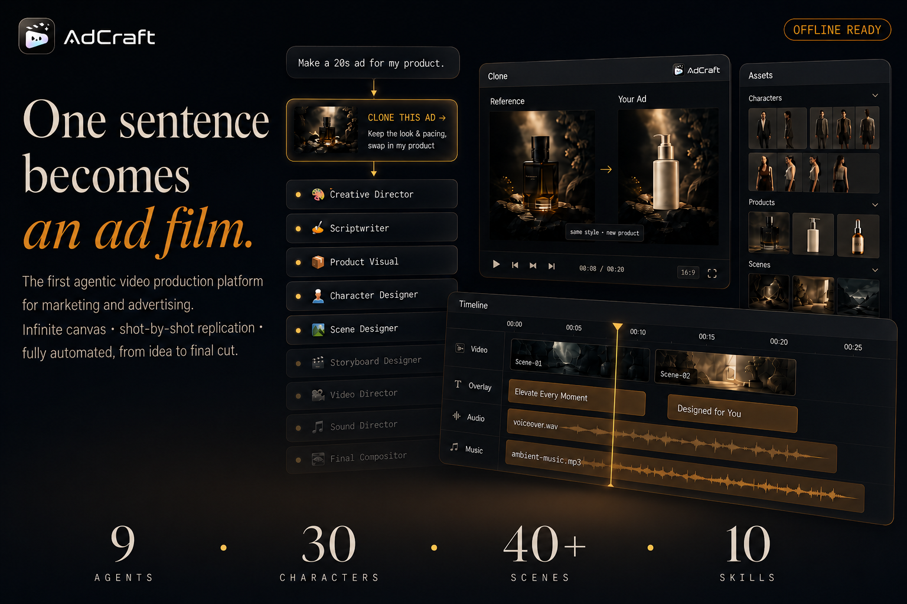

# AdCraft 🎬

### 首个面向营销广告的 Agentic 视频制作平台

**从一个模糊想法到成片交付，AdCraft 全流程自动化你的广告视频生产。**

[English](./README.md) · **简体中文** 

---

## 🎥 效果演示

  

 

> 你只需描述一个想法——*产品是什么、想突出什么卖点、希望什么风格、视频多长、投放在哪个平台*——AdCraft 就能自动为你生成一套完整、可编辑的广告制作流程。

---

## 📰 最新动态

- **[2026-08-28]** ✨ 新增风格 Skill 能力以及 Agent 对话生成节点优化。
- **[2026-08-19]** 🚀 强化并稳定了 Agent 引导式创作流程，同时完成 AdCraft 前端首页的视觉升级。
- **[2026-08-04]** ✨ Agent Canvas 完成重大升级，优化了交互体验并新增渐进式智能创作引导。
- **[2026-07-23]** 🗂️ 新增角色资产库与场景资产库。
- **[2026-07-15]** ⚙️ AdCraft 后端正式发布。
- **[2026-07-08]** 🎨 AdCraft 前端正式发布。
- **[2026-07-01]** 🎉 AdCraft 正式作为开源项目发布。
<!-- 后续更新持续追加到这里 -->

---

## 🌟 案例展示 · 覆盖多个行业

> 以下为使用 AdCraft 生产的真实广告视频，覆盖多个行业领域。
> <!-- 在这里放你不同领域的广告案例，建议用视频封面缩略图 + 播放链接 -->

<table>
  <tr>
    <td align="center"><b>🚗 汽车</b> </td>
    <td align="center"><b>🍔 食品</b> </td>
    <td align="center"><b>🥤 饮料</b> </td>
  </tr>
  <tr>
    <td align="center"><b>💄 美妆</b> </td>
    <td align="center"><b>👗 服饰</b> </td>
    <td align="center"><b>🧴 日用品</b> </td>
  </tr>
  <tr>
    <td align="center"><b>🔌 电器</b> </td>
    <td align="center"><b>📱 电子产品</b> </td>
    <td align="center"><b>➕ 更多敬请期待</b> </td>
  </tr>
</table>

---

## 💡 AdCraft 是什么？

AdCraft 是一个**面向广告创作的 AI 生产平台**。你无需提前设计制作流程，只要描述你的需求，系统就会自动组织起整个链路：**创意策划 → 脚本 → 商品视觉 → 角色 → 场景 → 分镜 → 素材生成 → 剪辑合成 → 最终成片。**

它不只是生成一条视频，而是把广告制作组织成一套**可编辑的创作流程**。生成后，你还能通过画布操作或与 AI 对话，随时修改任意内容——某个角色、某个场景、某个镜头、某张图片、某段视频，乃至整条广告。

  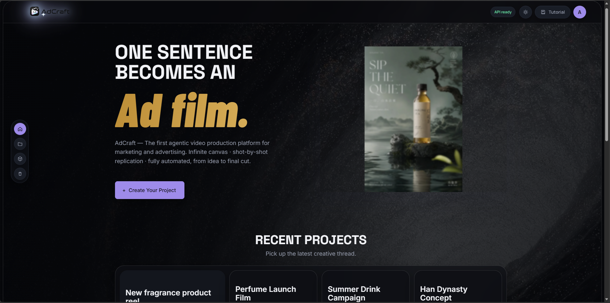
    
  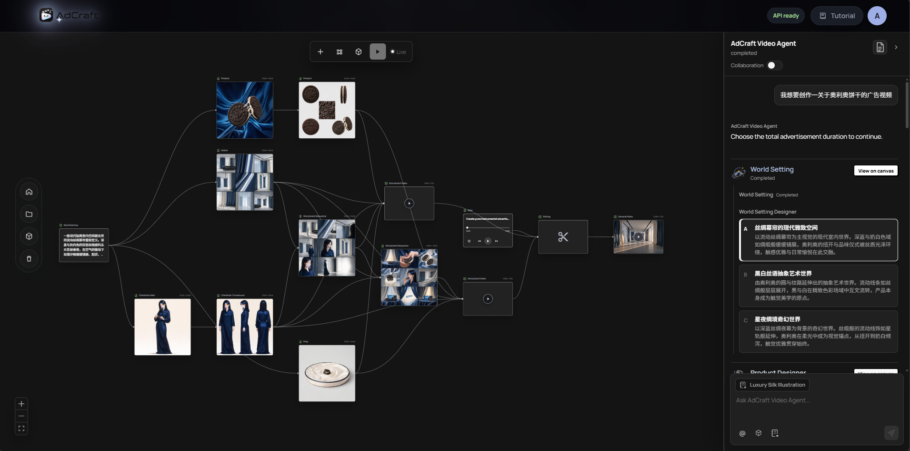

---

## ✨ 核心能力

### 1. 🎯 从模糊想法生成完整广告方案
你不需要提前设计制作流程。只要描述广告需求，系统会自动生成**广告脚本、商品视觉方案、角色设定、场景设计、分镜脚本、分镜图、分镜视频、背景音乐和最终合成方案。**

### 2. 🧩 广告流程可以自由编辑
系统生成的是一套**可编辑的创作流程**，而不是固定流水线。你可以增删环节、调整顺序、修改内容，也可以只运行某一个环节，或从某一步继续往下生成。已满意的素材会保留，无需反复重做。

### 3. 💬 用对话直接控制创作
你可以直接对 AI 说：*"修改第三个镜头""重生成这个角色""把这张图作为后面镜头的参考""整体更清爽一点"。* 系统会理解你**想改哪里、怎么改**，并生成新的候选结果，必要时先向你确认。

### 4. 🤖 专业 AI Agent 分工协作
系统内置多个专业创作 Agent，分别负责广告生产的不同环节：

| Agent | 职责 |
|-------|------|
| 🎨 **创意总监** | 理解需求、拆解广告目标、规划整体创作流程 |
| ✍️ **脚本创作** | 广告结构、卖点表达、口播文案与字幕文案 |
| 📦 **商品视觉** | 商品图、包装图、卖点展示图与细节图 |
| 👤 **角色设计** | 模特、虚拟人物、品牌代言人或游戏角色 |
| 🏞️ **场景设计** | 空间、环境、光线、天气与氛围 |
| 🎬 **分镜设计** | 镜头拆分、景别、运镜与时长 |
| 🎥 **视频导演** | 把分镜图或参考图生成视频片段 |
| 🎵 **声音导演** | 背景音乐、音效、旁白与节奏 |
| 🎞️ **最终合成** | 把视频、字幕、音乐与商品素材组织成完整成片 |

### 5. 📚 贯穿全流程的统一资产库

所有上传和生成的图片、视频与音频都会进入**统一资产库**，而不是成为使用一次就丢弃的临时文件。

每项资产都会保留自身的**来源、版本历史、生成说明、使用状态和项目引用关系**，让已经确认的创作素材可以在不同镜头、工作流和广告项目之间方便地复用。

AdCraft 针对不同类型的生产素材维护独立资产库：

- **角色资产库** — 沉淀可复用的角色体系，保持角色在不同镜头和广告活动中的身份一致性
- **场景资产库** — 构建连贯的视觉世界，提供多镜头、多视角参考
- **商品资产库** — 管理包装、正反面、侧面、材质和细节特写
- **图片、视频与音频资产库** — 统一整理创作过程中上传和生成的各类媒体

资产可以继续复用、扩展、重新生成，也可以保存为后续环节的参考，无需重新启动整套工作流。

### 6. 🗂️ 可直接投入生产的角色与场景资产

AdCraft 持续提供可复用的角色和场景资产，适用于广告制作、品牌叙事、短视频创作和 AI 辅助生产。

这些资产不是彼此孤立的参考图片，而是按照**完整生产体系**设计，能够在不同镜头、机位、动作、环境和商业场景中维持视觉一致性。

#### 👤 角色资产库

  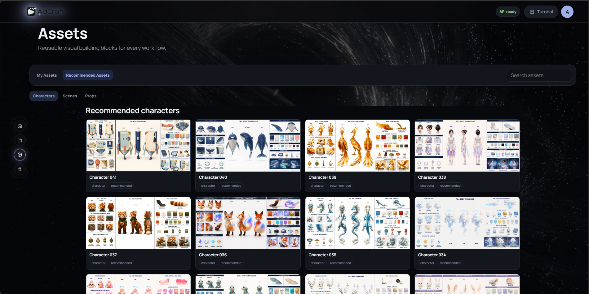
    
  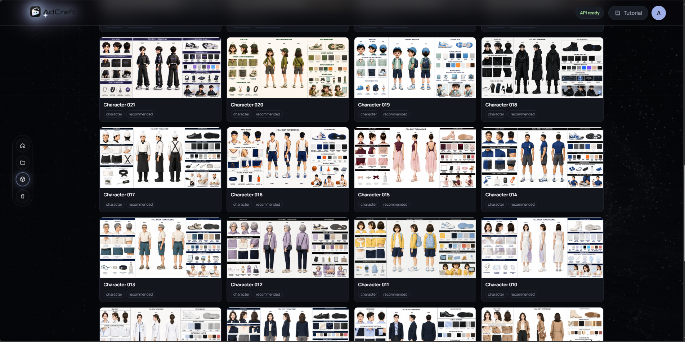
   
  
    在 AdCraft 中直接浏览、管理和复用可投入生产的角色资产。
  

 

我们免费开源发布的每项角色资产都按照一份**完整角色规格**设计，而不是只有一张肖像或概念图。

一套典型的角色资产包括：

- **角色三视图** — 正面、侧面和背面视图，用于稳定角色身份和身体比例
- **头部与面部参考** — 面部结构、发型、侧脸、背面和表情细节
- **服装结构细节** — 服装结构、剪裁、材质、褶皱和关键设计元素
- **配饰与随身物品** — 鞋履、首饰、手表、包袋、道具和其他可见细节
- **统一色彩与材质方案** — 保持颜色、织物、金属和表面质感一致
- **扩展商业应用场景** — 商品互动、广告姿势、商务环境和适用于广告活动的动作参考

这些参考共同帮助同一角色在特写、全身镜头、不同姿势、机位变化、商品互动和新生成的广告场景中保持一致。

<table>
  <tr>
    <td width="33.33%" align="center" valign="top">
      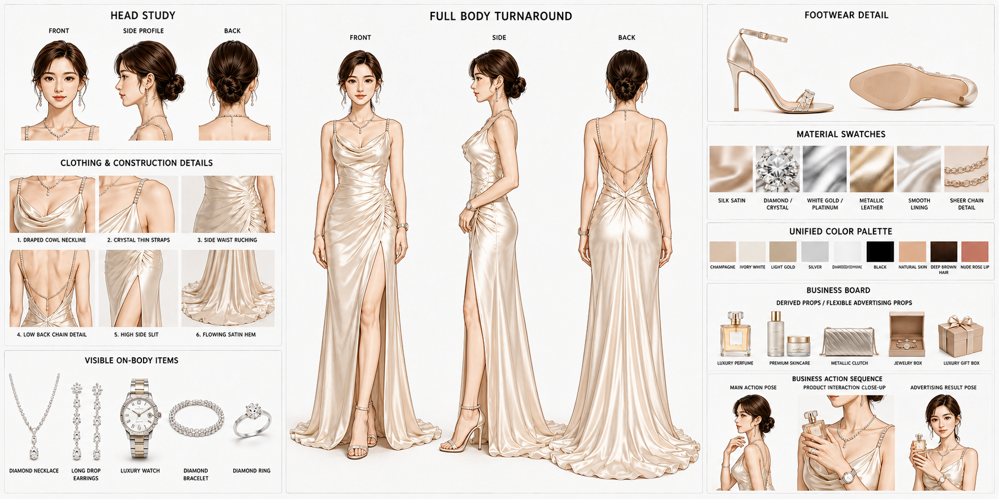
       
      <b>角色资产示例 01</b>
    </td>
    <td width="33.33%" align="center" valign="top">
      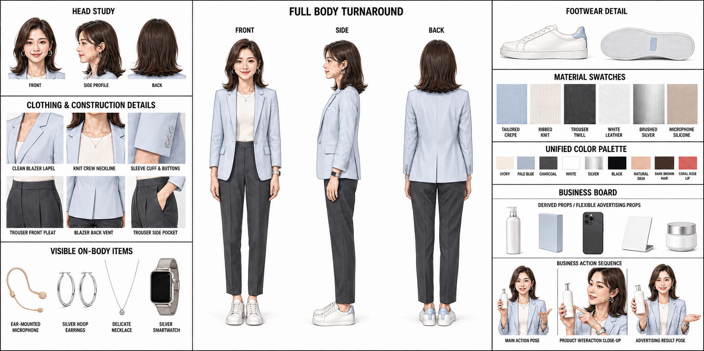
       
      <b>角色资产示例 02</b>
    </td>
    <td width="33.33%" align="center" valign="top">
      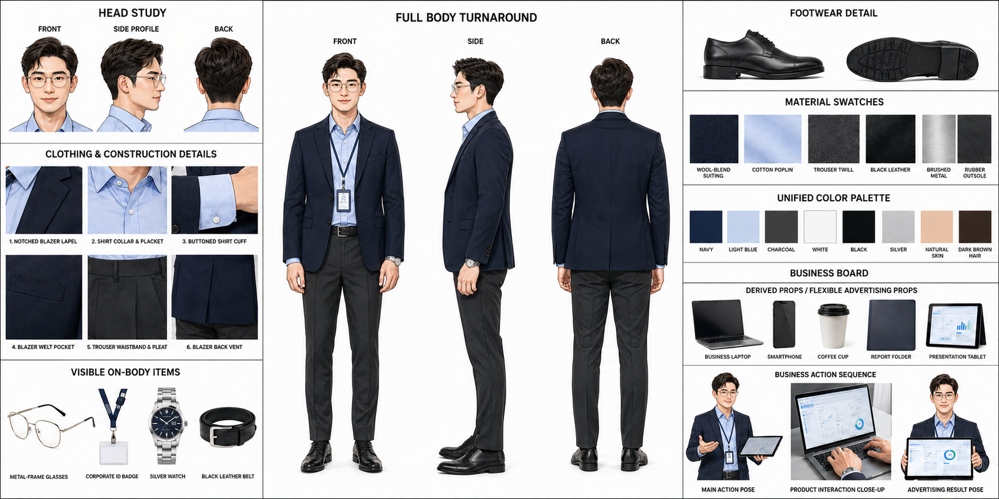
       
      <b>角色资产示例 03</b>
    </td>
  </tr>
  <tr>
    <td width="33.33%" align="center" valign="top">
      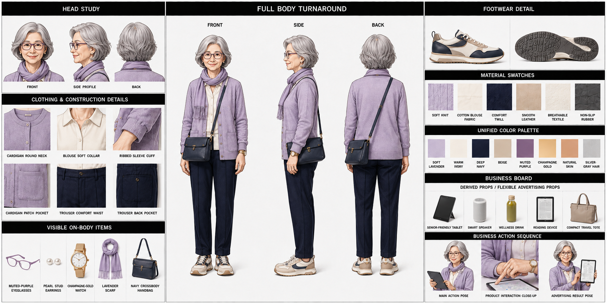
       
      <b>角色资产示例 04</b>
    </td>
    <td width="33.33%" align="center" valign="top">
      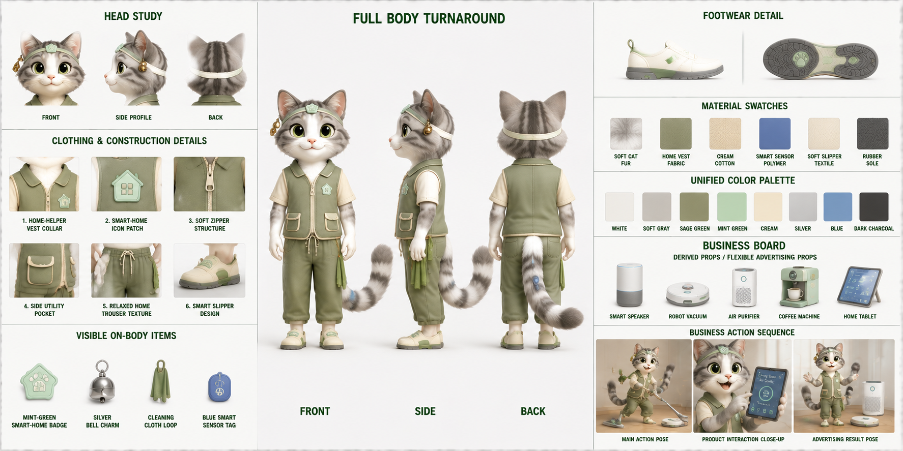
       
      <b>角色资产示例 05</b>
    </td>
    <td width="33.33%" align="center" valign="top">
      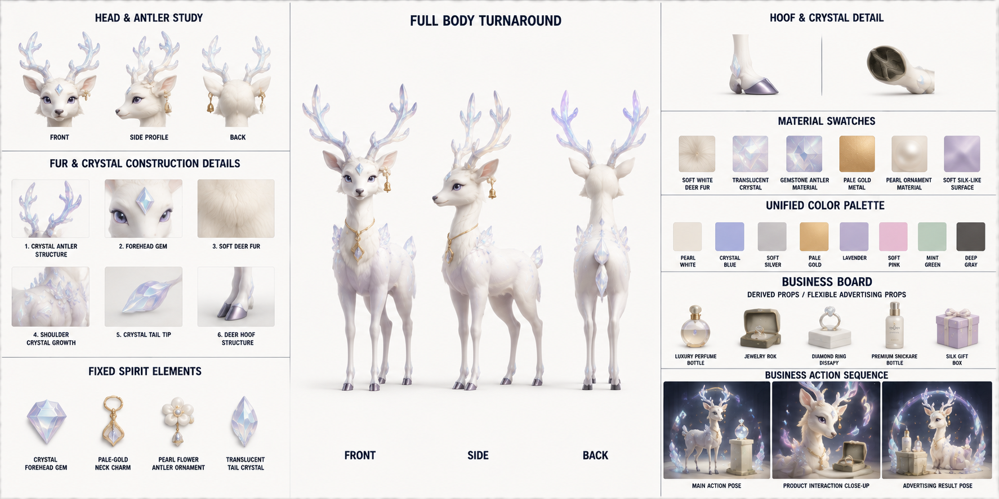
       
      <b>角色资产示例 06</b>
    </td>
  </tr>
  <tr>
    <td colspan="3" align="center">
      
        完整角色规格覆盖三视图、面部参考、服装细节、材质、配饰、道具和扩展商业场景。
      
    </td>
  </tr>
</table>

#### 🌍 场景资产库

  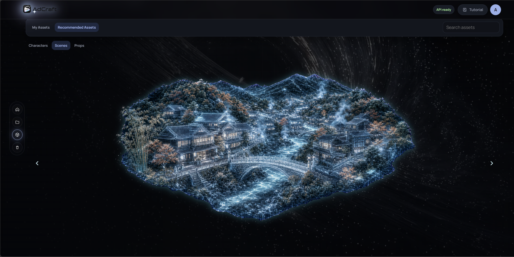
    
  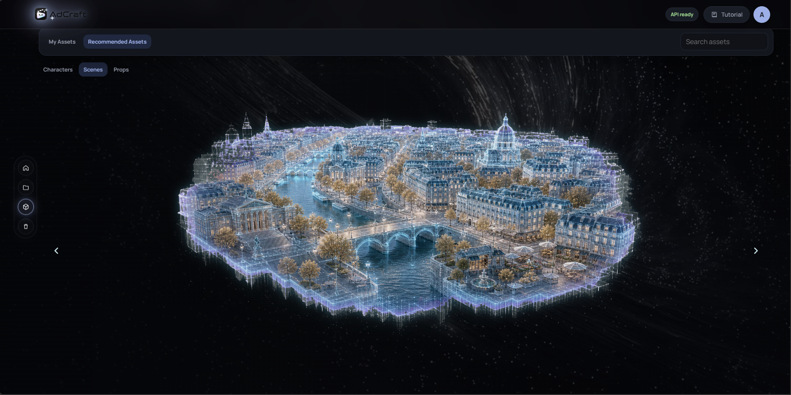
   
  
    浏览可复用的场景世界，并将其直接保存到 AdCraft 工作区。
  

 

AdCraft 的场景资产按照**完整的世界构建分镜体系**设计，而不是单独的背景图片。

每项场景资产通常包含一组能够直接用于分镜的连贯画面，其中包括：

- **建立镜头** — 明确整体地点和视觉特征
- **全景、中景与近景** — 满足不同叙事需要
- **同一环境中的多机位与多视角画面**
- **室内、室外和环境细节镜头**
- **适合角色进入的表演区域** — 支持动作、对话和商品互动
- **转场与衔接镜头** — 用于构建连续场景
- **一致的建筑、光线、氛围、地理关系和视觉语言**

这让创作者和 AI Agent 能够在同一个视觉世界中构建完整镜头序列，同时维持不同镜头之间的环境连续性。

<table>
  <tr>
    <td width="33.33%" align="center" valign="top">
      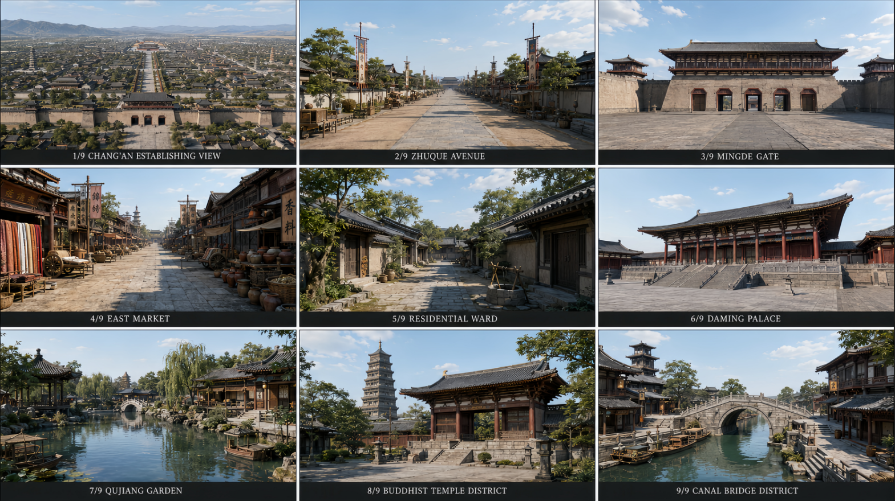
       
      <b>场景资产示例 01</b>
    </td>
    <td width="33.33%" align="center" valign="top">
      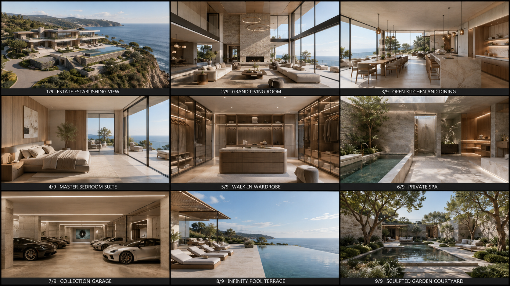
       
      <b>场景资产示例 02</b>
    </td>
    <td width="33.33%" align="center" valign="top">
      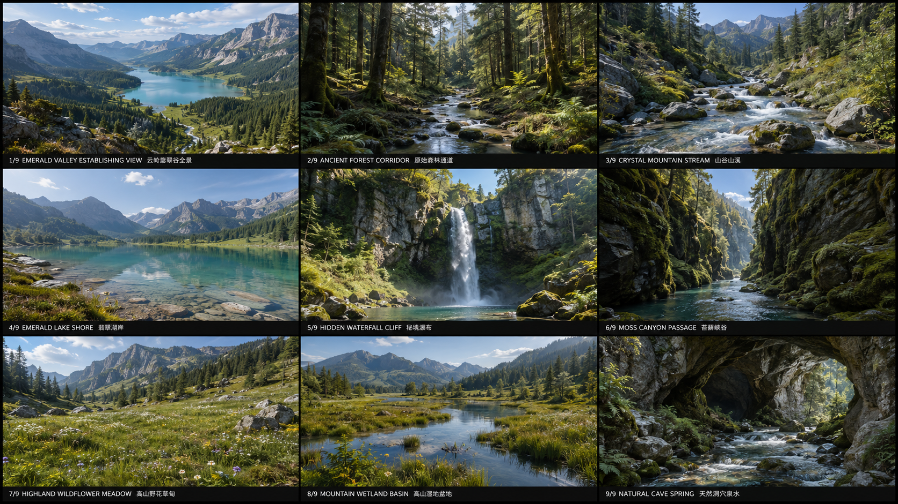
       
      <b>场景资产示例 03</b>
    </td>
  </tr>
  <tr>
    <td width="33.33%" align="center" valign="top">
      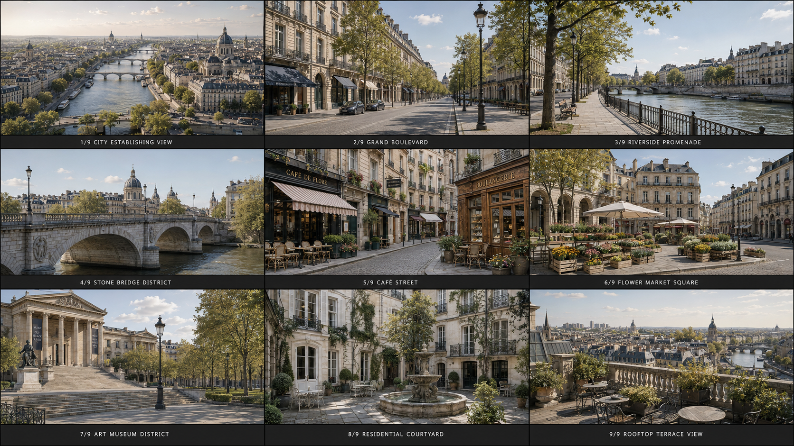
       
      <b>场景资产示例 04</b>
    </td>
    <td width="33.33%" align="center" valign="top">
      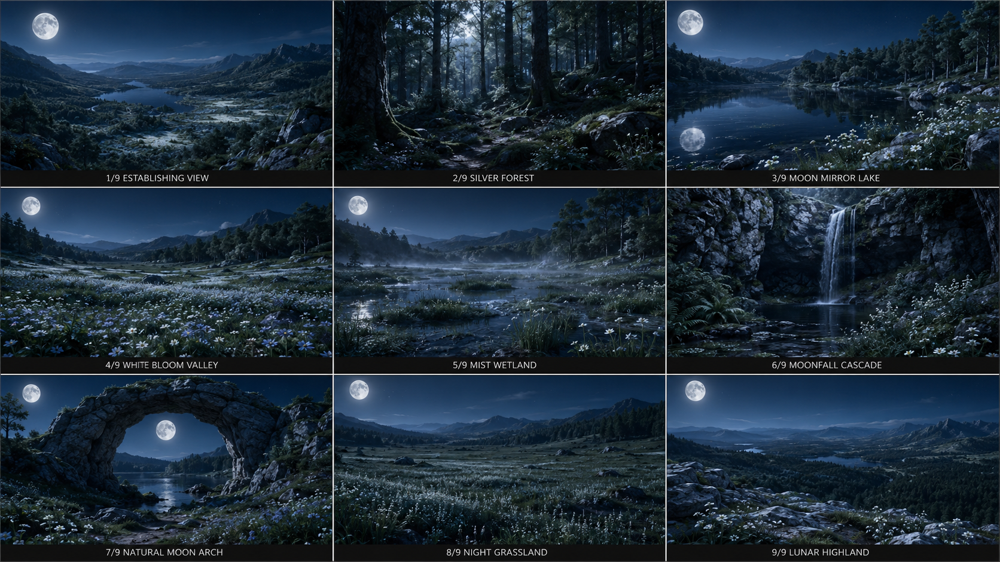
       
      <b>场景资产示例 05</b>
    </td>
    <td width="33.33%" align="center" valign="top">
      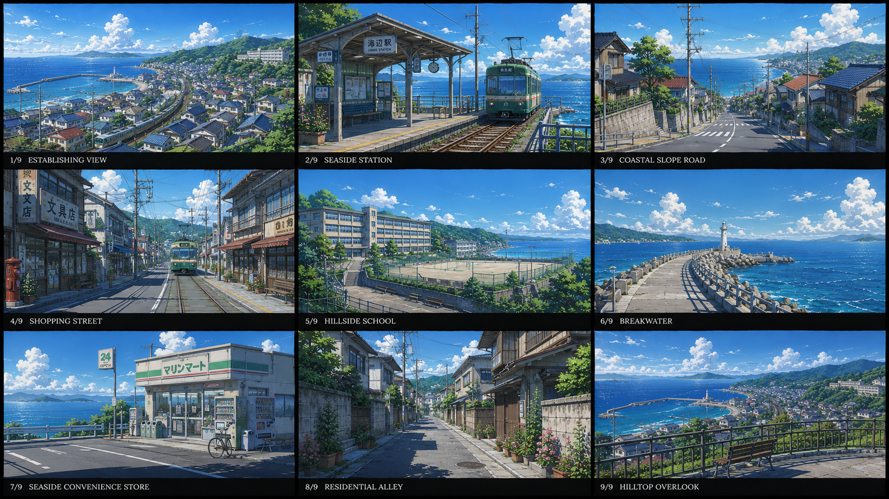
       
      <b>场景资产示例 06</b>
    </td>
  </tr>
  <tr>
    <td colspan="3" align="center">
      
        完整的世界构建分镜覆盖统一地点、景别、机位视角、环境细节、光线和氛围。
      
    </td>
  </tr>
</table>

### 7. 🎛️ 可以精细修改到具体内容
你既可以修改整个创作环节，也可以只改某个角色、场景、镜头、图片或视频。**局部修改只影响相关内容**，不会覆盖其他已满意的结果。

### 8. 🔄 支持候选版本与历史回滚
每次重新生成的内容都会先作为**候选版本**——可预览、接受、拒绝、切换或回滚。确认后的版本才会进入当前广告，也可以保存进素材库供后续项目复用。

### 9. 📊 真实展示生成进度
广告生成过程中，画布会展示每个环节的**真实状态**：排队中、生成中、等待确认、已完成、失败、已跳过等。多个环节同时运行时，你也能清楚看到哪些内容正在生成、哪些已完成。

### 10. ✂️ 最终剪辑与成片合成
最终合成环节会把已确认的视频片段、背景音乐、字幕、商品图等素材组织到**可编辑时间线**中。你可以调整片段顺序、裁剪时长、编辑字幕、调节音频与素材启用状态，最后渲染出完整广告成片。

### 11. 🧬 视频克隆：拆解参考片，再生成新广告
上传一条参考广告或短视频，系统会像专业创作者"拉片"一样逐镜头分析：开头如何吸引注意、镜头如何切换、每个镜头的景别与运镜、角色做了什么动作、商品如何出现、字幕与音效如何配合、整体节奏在哪里加速或停顿。

拆解完成后，系统会把参考视频转成一套**可编辑的广告结构**。你可以保留原片的节奏、镜头结构和叙事方式，但替换成**自己的商品、角色、场景、风格和文案**，生成一条"结构相似但内容全新"的广告。

> 这不是简单复制，而是把优秀广告的镜头语言、节奏和表达方式，转化成**可复用的创作流程**。

### 12. ⚡ 预设创作流与 Skill 模板
系统会沉淀不同广告场景的预设创作流和 Skill 模板，例如**商品展示广告、游戏买量广告、电商种草广告**等。选择一个场景，就能快速进入对应的广告创作流程。

### 13. 🔌 支持多平台模型，一键配置调用
AdCraft 不绑定单一生成模型，而是支持接入多个主流图片、视频和音频生成平台：
- **图片生成** — 即梦、豆包/Seedream、通义万相、腾讯混元图像、MiniMax Image 等
- **视频生成** — Seedance、即梦、可灵 Kling、海螺 Hailuo、Vidu、通义万相 Wan、腾讯混元视频等
- **音频生成** — MiniMax Speech/Music、CosyVoice、豆包语音、腾讯云语音、讯飞星火语音、百度智能云语音等

你可以在**配置中心**统一管理 API Key、默认模型、比例、清晰度、时长、是否生成音频、是否加水印等参数。不同环节可选择不同平台，也可设置默认平台与备用平台，让广告生产更灵活、更稳定。

### CLIProxyAPI 集成

本项目支持通过 Docker Compose sidecar 接入 CLIProxyAPI，将 AdCraft 的 LLM 请求转发到已配置的兼容模型服务。配置、OAuth 凭据和本地 API Key 均只保存在本机，详见 [CLIProxyAPI Compose 配置指南](docs/cliproxyapi-compose-setup_zh.md)。

---

## 🏗️ 工作原理
💡 想法 → 🎨 创意方案 → ✍️ 脚本 → 📦 商品视觉 → 👤 角色
↓
🚀 成片 ← 🎞️ 合成 ← 🎵 声音 ← 🎥 视频 ← 🎬 分镜 ← 🏞️ 场景

全程由 AI Agent 编排，在无限画布上自由编辑。

---
## 🤝 贡献

欢迎提交 Pull Request，为 AdCraft 贡献代码、功能改进、Bug 修复或其他优化，并成为项目贡献者。

## 💬 联系我们

如果你有任何问题、建议、合作意向或其他需求，欢迎通过邮件联系我们：

* **马飞** — [mafei@gml.ac.cn](mailto:mafei@gml.ac.cn)
* **徐洪波** — [xuhongbo@gml.ac.cn](mailto:xuhongbo@gml.ac.cn)

**⭐ 如果 AdCraft 对你有帮助，欢迎给我们一个 Star！**

Made with ❤️ by **GML-MMGroup**

